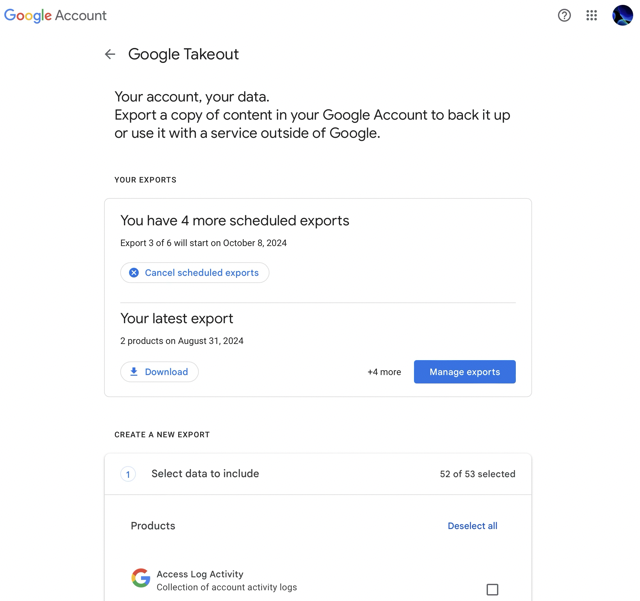
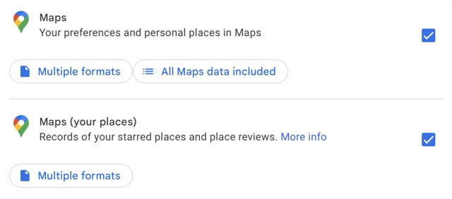
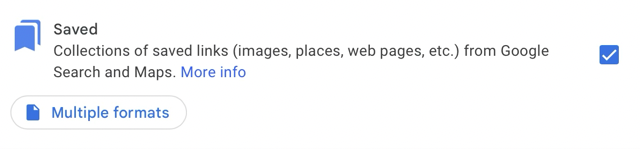

# LittleLocations

All things Little Locations

## Exporting your Google Places

Go to https://takeout.google.com to create an export of your places stored with Google:

1. To avoid long waiting times click "Deselect all".

   

2. Then select at least "Maps (your places)" which contains your custom Google Maps Lists and "Saved" which contains your favourite places. Optionally select "Maps" which contains your reviews and uploaded photos related to maps.

   
   

3. Use the "Next step" button at the bottom to go to the next page.

4. Click "Create export".

5. Wait for the export to finish. Either by checking https://takeout.google.com/manage or getting a notification email.

   This will take at least some miniutes, sometimes an hour. If you select more items to export, it can even take more time.
